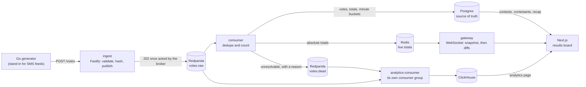
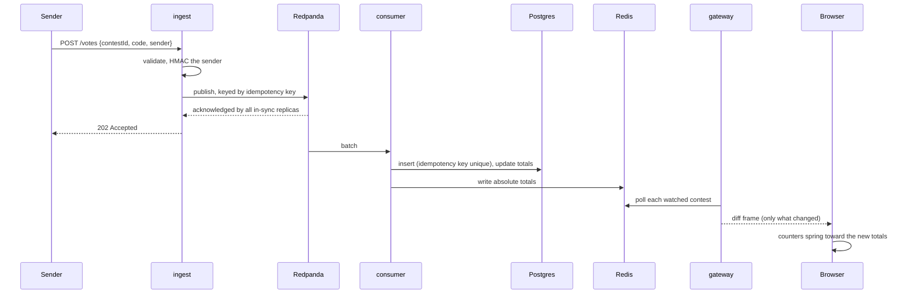
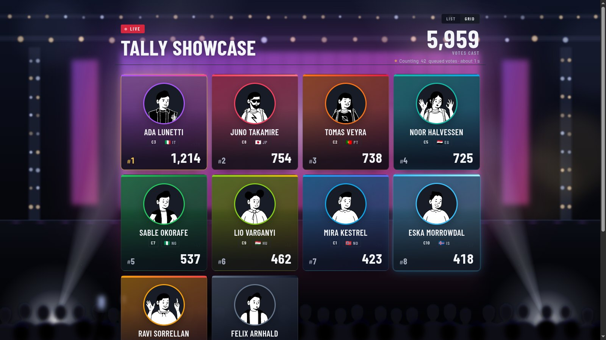
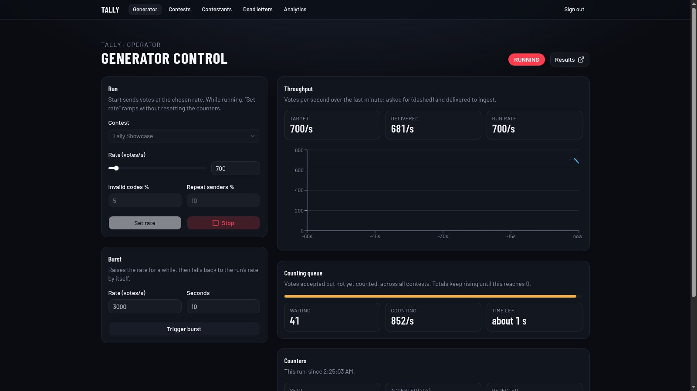
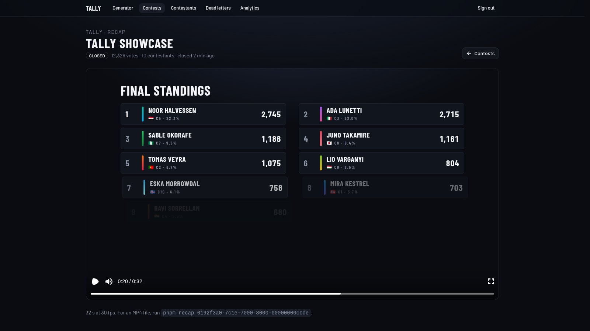

# Tally

**A real-time voting platform: votes arrive over HTTP, pass through a Kafka-compatible queue, are counted exactly once, and appear on a live results board within about a second.**

It's modelled on a production SMS voting system built for a live televised talent contest. A controllable Go load generator stands in for the telecom feeds.

[](docs/media/demo.mp4)

<sub>Live voting at 700 votes/s, a lead change, then voting closes: 23 s, [MP4](docs/media/demo.mp4). The stage, the lights and the audience are drawn in SVG and CSS, not photographed.</sub>

## In 30 seconds

- **Event-driven pipeline.** Ingest only validates, hashes the sender and publishes. It answers `202` once the broker has the vote, and never touches a database in the request path. A consumer counts, a WebSocket gateway fans the totals out, and analytics reads the same stream separately.
- **Correct under at-least-once delivery.**
  - Every vote carries an idempotency key, and Postgres is the single place duplicates are caught.
  - Redis only ever receives absolute totals, so a redelivered message can't count twice.
  - A vote that can't be resolved goes to a dead-letter topic with a reason; none is dropped silently.
  - `pnpm reconcile` proves every derived count against the vote log.
- **Measured, not claimed.** On a laptop running the whole stack: 1,000 votes/s sustained and 3,000 votes/s bursts at p95 7–20 ms, with every accepted vote counted exactly once ([numbers below](#performance)).
- **A board built for the overtake.** Counters retarget a spring instead of restarting, so four updates a second read as one continuous climb. Rows glide past each other when one overtakes another, and the searchlights follow the lead.

## Architecture



One vote, end to end:



| Service | Role |
|---|---|
| `services/ingest` | Fastify. Validate, hash the sender, publish, return `202`. Thin on purpose, so it runs as several replicas behind nginx (`INGEST_REPLICAS`). |
| `services/consumer` | Resolves codes, dedupes, and writes votes, totals and per-minute buckets to Postgres and absolute totals to Redis. Rebuilds Redis from Postgres at startup. |
| `services/gateway` | WebSocket fan-out: a snapshot on connect, then diffs. One Redis poll per watched contest, however many viewers. |
| `services/analytics-consumer` | Copies both topics into ClickHouse, rows as delivered. |
| `tools/generator` | Go load generator with a control API. Rate, bursts, invalid codes and repeat senders are all tunable. |
| `apps/web` | Next.js: the results board, the generator panel, contest and contestant admin, dead letters, analytics and recap videos. |
| `packages/*` | Zod contracts (shared by every service; the Go generator has a contract test), the Drizzle schema, and the Remotion recap. |

## What it looks like

| | |
|---|---|
|  |  |
| **Results board.** Live totals, "+N" as votes land, the counting queue under the total. | **Card grid.** The same component and data, arranged by a layout flag. |
|  |  |
| **Generator panel.** Rate and bursts, delivered versus asked for, and the counting queue draining. | **Recap.** A closed contest as a 32 s video: bar race, final standings, winner. Rendered with Remotion. |

Also in the app:
- creating contests (draft, open, close, reopen)
- contestants, with a sample list to review before saving
- a dead-letter browser that shows the reason for every rejected vote
- an analytics page served entirely from ClickHouse
- Grafana dashboards for throughput and consumer lag

## Performance

Performance targets apply to the data pipeline. The generator is a mock of the real vote sources, so the board isn't benchmarked against its maximum rate.

Measured with k6 against `POST /votes`, with the whole pipeline running, on a developer laptop that also runs k6, every service and the desktop (Intel i5-1135G7, 4 cores / 8 threads, 15 GB). After each run the script waits for the consumer to drain, checks that every vote ingest accepted was counted exactly once, and runs reconciliation.

| Profile | Rate at the peak | p50 / p95 / p99 at the peak | Errors | Max consumer lag | Accepted → counted | Drift |
|---|---|---|---|---|---|---|
| Steady: 1,000/s held 3 min | 1,000 votes/s | 4.1 / **7.0** / 8.2 ms | 0 | 140 messages | 217,499 → 217,499 | none |
| Spike: 500 → 3,000/s for 1 min | 3,000 votes/s | 5.7 / **14.4** / 29.0 ms | 0 | 938 messages | 282,499 → 282,499 | none |
| Spike, second run | 2,999 votes/s | 5.8 / **20.1** / 44.0 ms | 0 | 1,038 messages | 282,467 → 282,467 | none |

The spec's targets were 1,000 votes/s sustained, 3,000+ in bursts, p95 under 50 ms and zero loss. All were met in these runs (F19). The consumer drained within a fraction of a second after each one. Full reports are in [`load-results/`](load-results).

- **Go generator, 3,000 votes/s for 60 s:** 190,850 sent, 0 failed, ingest p95 8.4 ms. The dead letters reconcile exactly: 9,695 invalid codes sent, 9,695 on `votes.dead`, 9,695 in `dead_letters`.
- **Analytics (ClickHouse):**
  - votes per minute across a 10M-vote contest, counted exactly: 313 ms
  - the last 30 minutes: 56 ms
  - the per-minute counts matched Postgres's exactly across all 83 minutes of a live contest (3,152,708 = 3,152,708)

**Caveats, measured rather than assumed:**
- **Laptop variance:** two identical spike runs differ by 6 ms at p95. In the second, k6 briefly ran short of virtual users and skipped 32 of its 282,499 scheduled requests. Those were never sent, so they don't count as lost.
- **The host port hop:** a run through Docker's host port forwarding had p95 70.7 ms. The published runs call ingest by service name inside the compose network, as a deployment would.
- **The stack has grown since F19.** ClickHouse, the analytics consumer, Prometheus and Grafana now share the same 8 threads, and k6's spike run no longer meets the p95 target at 3,000/s: it measures 70–107 ms, still with zero loss and no drift. Over the same stack, the Go generator's 3,000/s burst keeps ingest's p95 at about 9 ms. The investigation ([`DECISIONS.md`](DECISIONS.md), F23) fixed ClickHouse's idle logging and an undersized Postgres buffer. What's left looks like CPU contention between the load generator and the system under test, which a separate k6 machine would confirm.

## Decisions and trade-offs

The full record, with the alternatives considered each time, is [`DECISIONS.md`](DECISIONS.md). The ones that shape the system:

- **Postgres is the truth, Redis is speed.** Nothing lives in Redis that Postgres can't rebuild, and the consumer rebuilds it at every start. The cost is a start-up of minutes once the vote log holds millions of votes. The gain is that no failure can leave the live totals permanently wrong. (F5, F17)
- **Duplicates are caught in one place.** Postgres's unique idempotency key is the only dedupe, and Redis only receives absolute totals, never increments. So at-least-once delivery counts each vote exactly once, and a replay can't drift the board. (F5)
- **`202` means the broker has it.** The producer waits for all in-sync replicas (`acks=all`) and is idempotent; 5 ms micro-batches keep that cheap. A slower broker makes ingest slower, but a `202` is never a promise the queue can't keep. (F4)
- **Keyed by idempotency key, over 24 partitions.** Votes spread evenly whoever is winning, so a popular contestant can't load a single partition, and a retry lands where the first try did. Keying by contestant code (F4) kept each contestant's votes in order, which nothing needed, and put four of the ten codes on one partition. Java-compatible murmur2, so placement matches Redpanda's own tools. (F4, F35)
- **Dead letters are first-class.** Every rejection has a reason, lands in a Postgres table and a topic, and is browsable in the admin. (F5, F6, F15)
- **The gateway sends absolute totals: a snapshot, then diffs.** A missed frame is healed by the next one, and a reconnect resyncs without a page refresh. It makes one Redis poll per watched contest, independent of audience size. (F7, F11)
- **Closing is by acceptance time, under a lock.** A vote counts if ingest accepted it before the close, even if it's still queued. A lock handshake means no vote is half-counted at the cut-off. (F16)
- **Analytics is a separate workload.** ClickHouse reads the same topics under its own consumer group; stopping it leaves live results untouched, and it catches up. It uses exact distinct counts and no rollups: rollups stored every key again and were slower than scanning. (F20, F21)
- **Counters retarget, they don't restart.** Each new total is a new target for the same spring. The spring is overdamped, so a count never overshoots or runs backwards. (F9)
- **One component, two layouts.** The card grid is the list row with a flag; switching never remounts anything, so the live feed and animations carry straight on. (F24)
- **Deployable by configuration.** Every service reads config from the environment and keeps no local state, and each has `/health` and graceful SIGTERM. That's what makes deployment, and the optional Kubernetes phase, additive rather than a rewrite.

## Run it

```sh
cp .env.example .env              # then set VOTER_HASH_SALT and ADMIN_PASSWORD
pnpm install
docker compose --profile app up -d --build
pnpm check:health
```

| URL | What's there |
|---|---|
| http://localhost:3000 | Results boards |
| http://localhost:3000/control | Generator panel and admin (password from `.env`) |
| http://localhost:3001 | Grafana (anonymous viewer) |
| http://localhost:9090 | Prometheus |

**Generator on a second machine:** run `pnpm generator:exe` and copy `tools/generator/bin/generator.exe` and `run-generator.cmd` to a Windows PC on the same network, where neither Docker nor Go is needed. Then set `COMPOSE_FILE=compose.yaml:compose.two-device.yaml` and `GENERATOR_HOST=<its address>` in `.env`, and run `docker compose --profile app up -d`. The generator panel drives the remote generator as before.

Useful commands:

| Command | Does |
|---|---|
| `pnpm load steady` | k6 at 1,000/s (also `spike`, or `smoke` for a 20 s check), then checks zero loss |
| `pnpm reconcile` | recount every derived total from the vote log |
| `pnpm recap [contestId]` | render a contest's recap as an MP4 |
| `pnpm contests` | list contests with their IDs and vote counts |
| `pnpm reset:votes` | wipe all vote data, keeping contests and contestants |
| `pnpm test`, `pnpm lint`, `pnpm typecheck` | Vitest, Biome, TypeScript |

## Repository

```
apps/web                    Next.js: results, admin, generator control
services/ingest             Fastify: validate and publish
services/consumer           count into Postgres and Redis
services/gateway            WebSocket fan-out
services/analytics-consumer ClickHouse writer
tools/generator             Go load generator
tools/load                  k6 load profiles
tools/recap                 recap video renderer (CLI)
packages/contracts          Zod schemas and shared types
packages/db                 Drizzle schema, client, migrate and seed
packages/recap-video        recap video component and exporter
infra/                      migrations, ClickHouse, Prometheus and Grafana config
```

- [`SPEC.md`](SPEC.md): the system as specified, with notes wherever the build changed it
- [`IMPLEMENTATION_PLAN.md`](IMPLEMENTATION_PLAN.md): the feature-by-feature build order
- [`DECISIONS.md`](DECISIONS.md): every non-obvious choice, what else was considered, and how each feature was verified
